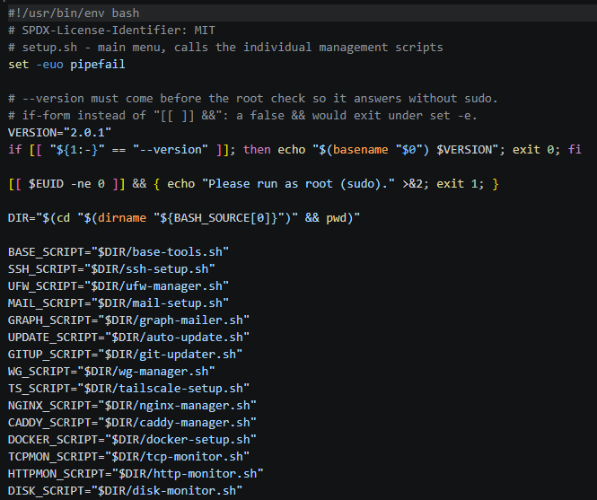

# mmo_linux_server_scripts



Bash tools for the tasks that are always the same on a Linux web server: base
setup, access, firewall, mail, updates, VPN, routing, reverse proxy and
monitoring. Sixteen scripts, one shared menu, no dependency between them.

Detailed documentation per tool: **[docs/](docs/)** — one file per tool, each
complete in itself. If you would rather do the same by hand,
**[docs/manual-setup.md](docs/manual-setup.md)** has the guide without any
script, using nothing but the standard tools.

```bash
sudo ./setup.sh          # menu covering all the tools
sudo ./caddy-manager.sh  # every tool also runs on its own
```

Every script is interactive and menu-driven, requires root and can safely be
called again and again — existing values come back as the defaults.

## Tools

The tools are arranged in three groups — that is how they appear in the menu,
and that is the order in which you set a server up.

### 1. Secure access

Who gets onto the machine, and by which route.

| Script | Purpose | Non-interactive |
|---|---|---|
| [base-tools.sh](base-tools.sh) | nano, vim, screen & co., coloured shell and editor defaults | `--status` `--uninstall` |
| [ssh-setup.sh](ssh-setup.sh) | harden SSH: port, root login, keys instead of passwords | `--status` `--uninstall` |
| [ufw-manager.sh](ufw-manager.sh) | create, change and delete firewall rules | `--status` `--uninstall` |
| [wg-manager.sh](wg-manager.sh) | WireGuard server and client configs | `--uninstall` |
| [tailscale-setup.sh](tailscale-setup.sh) | install Tailscale, log in, routes and exit node | `--status` `--uninstall` |
| [iptables-router.sh](iptables-router.sh) | pass traffic between the tunnel and other networks: forwarding, NAT, port forwarding | `--apply` `--clear` `--status` `--uninstall` |

`base-tools` is here because it is the first thing you do when you arrive on the
machine — it secures nothing, but nobody works without an editor.
`iptables-router` is here because it belongs to the VPN: the tunnel connects two
machines, and routing is what connects the networks behind them.

### 2. Monitor operation

The server reports on itself instead of making you go and look.

| Script | Purpose | Non-interactive |
|---|---|---|
| [mail-setup.sh](mail-setup.sh) | SMTP sending through msmtp — the channel for everything that follows | `--test` `--uninstall` |
| [graph-mailer.sh](graph-mailer.sh) | sending mail through Microsoft Graph, hooked in as sendmail | `--sendmail` `--test` `--status` `--uninstall` |
| [auto-update.sh](auto-update.sh) | apt updates via cron, with a mail report | `--run` `--status` `--uninstall` |
| [tcp-monitor.sh](tcp-monitor.sh) | check TCP reachability, alert on a state change | `--check` `--status` `--uninstall` |
| [http-monitor.sh](http-monitor.sh) | HTTP status code, response time and certificate expiry | `--check` `--status` `--uninstall` |
| [disk-monitor.sh](disk-monitor.sh) | disk space and inodes, alert on a state change, forecast | `--check` `--status` `--uninstall` |

A mailer first: an update run or a monitor whose message reaches nobody is
unattended.

### 3. Applications

What the server actually serves.

| Script | Purpose | Non-interactive |
|---|---|---|
| [nginx-manager.sh](nginx-manager.sh) | nginx as a TCP relay with SNI routing, TLS passed through to the backend | `--uninstall` |
| [caddy-manager.sh](caddy-manager.sh) | Caddy vhosts with TLS terminated on the server | `--uninstall` |
| [docker-setup.sh](docker-setup.sh) | Docker from the official repo, log rotation, cleanup | `--prune` `--status` `--uninstall` |
| [git-updater.sh](git-updater.sh) | keep git working copies up to date via cron, optionally with a Docker Compose deployment and a command afterwards | `--run` `--status` `--uninstall` |

`--run` and `--check` are the cron runners, which is why they do not appear in
the menu.

Every script also knows `--version` — without root, too.

## The order on a fresh server

```bash
sudo ./setup.sh
```

Work through it from top to bottom — the three groups are the setup order:
**first secure access, then establish the notification path, then put
applications on top.**

**Group 1 — secure access.** Base tools, so you can work. Then SSH hardening,
and before the firewall at that: `ssh-setup` opens the new port in ufw itself,
and the firewall then already knows which port has to stay open. Then ufw, then
optionally a VPN — and only after that `iptables-router`, which needs a tunnel
that is already up. For all of this: **keep a second SSH session open.**

**Group 2 — monitor operation.** First a mailer (msmtp *or* Graph), and only
then everything that sends reports: automatic updates, then the monitors.

**Group 3 — applications.** Reverse proxy (nginx *or* Caddy), Docker, and the
git updater as soon as code from a repo sits on the server.

The monitors from group 2 can also be set up last — all they need is something
to monitor. Everything else in this order.

## Three either-or decisions

| Question | Take A if … | Take B if … |
|---|---|---|
| **msmtp** or **Graph** | an SMTP account with a user and a password works | Microsoft 365 has blocked SMTP AUTH — then only Graph is left |
| **WireGuard** or **Tailscale** | few fixed peers, no external dependency wanted | many changing devices, NAT on both sides, central rights management |
| **nginx** or **Caddy** | the backend has its own certificate and should keep it | terminate TLS here, certificates automatically |

With the mailers and the reverse proxies it really is an either-or: both mailers
want to be `/usr/sbin/sendmail`, both proxies want port 443. WireGuard and
Tailscale, by contrast, run happily side by side.

## nginx or Caddy?

Both occupy port 443, **at the same time is not possible**. The difference is
where TLS is terminated:

| | nginx-manager | caddy-manager |
|---|---|---|
| TLS terminated | at the backend | on this server |
| The certificate lives | on the backend | here (automatically, from Let's Encrypt) |
| Routing by | SNI (`ssl_preread`) | HTTP host |
| The backend sees | the real TLS connection | decrypted HTTP traffic |
| Good for | passing through to appliances/VMs with their own certificate | ordinary web apps behind a reverse proxy |

Rule of thumb: if the backend brings its own certificate and should keep it,
nginx. Otherwise Caddy — that saves the entire certificate management.

## Base tools (`base-tools`)

**`git` and `ca-certificates` are always installed**, without asking — you do
not get far on a server without them, and the git updater requires git.

Everything else in four groups, each one deselectable: editors (`nano vim`),
terminal sessions (`screen tmux`), tools (`htop curl wget unzip rsync tree ncdu
bash-completion`) and, optionally, network diagnostics (`dnsutils net-tools
mtr-tiny`). Installation happens package by package; a package name unknown on
the distribution at hand does not abort the run.

Plus four sets of defaults:

| File | Contents |
|---|---|
| `/etc/profile.d/zz-base-tools.sh` | colours (`dircolors`), aliases, history settings, prompt (root red, user green) |
| `/etc/bash.bashrc` | a marked block that loads the file above for non-login shells too |
| `/etc/vim/vimrc.local` | line numbers, search, 4-space indent, **`set mouse=`** |
| `/etc/nanorc`, `/etc/screenrc` | marked blocks: line numbers, and scrollback plus a status line |

Two details that are otherwise a regular annoyance:

- **`/etc/profile.d` alone is not enough.** It is only read by login shells.
  `ssh host command`, `su` and screen would otherwise get none of it — hence the
  reference from `/etc/bash.bashrc`.
- **`set mouse=` in vim.** From vim 8.2 on, the mouse is on by default; vim then
  switches to visual mode when you select, and copying out of the terminal stops
  working.

Foreign files are not overwritten: in `/etc/nanorc`, `/etc/screenrc` and
`/etc/bash.bashrc` the tool's own content sits in a `# >>> base-tools >>>`
block, and an existing `vimrc.local` is backed up to `.orig`.

## SSH hardening (`ssh-setup`)

One pass: first all the questions (port, root login, password login,
MaxAuthTries, LoginGraceTime, X11, ClientAlive), then a summary, then **one**
confirmation. Nothing is touched before that.

The only thing written is a drop-in in
`/etc/ssh/sshd_config.d/99-ssh-setup.conf` — the `sshd_config` itself stays as
it is.

Guardrails against locking yourself out:

- **Order ufw → sshd.** The new port is open in the firewall *before* sshd moves
  there. **Port 22 stays open alongside for now**; menu item 4 closes it once
  the test over the new port has worked — and refuses as long as sshd still
  listens on 22 itself.
- **`sshd -t` before every apply**, with a rollback to the previous drop-in if
  the check fails.
- **`ssh.socket` is detected.** From Ubuntu 22.10 on, sshd starts through socket
  activation and ignores the `Port` directive from the configuration entirely —
  the port has to be set on `ssh.socket`. Without that detection you move the
  firewall to the new port while sshd keeps listening on 22. In that case a
  socket drop-in is written as well.
- **Password login is only switched off when an `authorized_keys` exists
  somewhere.** If there is no key, it stays on — with a pointer to menu item 3,
  which stores one.
- **Root login "no" plus passwords "off" is caught** when only root has a key.
  Otherwise nobody would get in any more.
- **Whether the drop-in actually arrives is verified.** With sshd the directive
  read *first* wins: if the `sshd_config` already has a
  `PasswordAuthentication yes` above the `Include` line, the drop-in has no
  effect. After writing, it is therefore checked against `sshd -T`, and
  commenting the conflicting lines out is offered.
- **If the `Include` line is missing entirely** (older distributions), it is
  added at the top of the `sshd_config` — between markers, so the uninstall can
  take it out again.

Even so: while hardening, always **keep a second SSH session open**.

## Firewall (`ufw-manager`)

CRUD on ufw rules — create, replace, delete, plus application profiles, defaults
and logging. There is no rule file of its own: `ufw` itself is the data store,
and the menu always shows `ufw status numbered`.

The creation wizard asks for the action (`allow` / `deny` / `reject` / `limit`),
the direction, the target (port, port range, application profile or everything),
the protocol, the source, the destination IP and a comment — and **shows the
finished ufw command before it runs**. So you see exactly what happens, and pick
up the syntax along the way.

- **Before switching on**, it is checked whether there is an ALLOW or LIMIT rule
  for the SSH port at all. If it is missing, `ufw limit <port>/tcp` is offered;
  if you decline and are sitting on an SSH connection yourself, a second,
  unmistakable question follows. With `default deny incoming`, a `ufw enable`
  without an SSH rule is a guaranteed lockout.
- **When deleting**, the rule is shown in plain text, and if it concerns the port
  of the running SSH session, there is a warning.
- **Numbers shift.** Between display and deletion it is therefore checked again
  whether the same rule still sits under that number — otherwise nothing
  happens.
- **Editing means: create the new rule, then delete the old one** (ufw cannot
  change rules). In that order, so that no gap ever opens up; the old rule's
  number is afterwards resolved again by its text.
- For SSH, `limit` is the better choice than `allow`: at most six connections in
  30 seconds per IP, which slows brute force down without extra software.
- **Interface rules** (`allow in on wg0 …`) are part of the wizard's questions.
  As soon as an interface is involved, the long syntax is built automatically —
  ufw does not understand the short form there.

### SSH only over WireGuard

A menu item of its own, because the order is the hard part. It runs in two
stages: on the first call it checks that the interface exists and that the
**WireGuard UDP port is open** (without it the tunnel never comes up, and with
it nothing else), then creates `allow in on wg0 … port <sshport>` and
deliberately leaves the open SSH rule in place. Only the second call — after a
successful login through the tunnel — offers to remove it.

An interface rather than a source CIDR, because `in on wg0` binds to the
interface; a rule on the tunnel subnet would depend on sender IPs, which can be
forged if no reverse path filter is in effect.

## Automatic updates (`auto-update`)

A cron job in `/etc/cron.d/auto-update`, daily or weekly at a chosen time.

| Setting | Options | Default |
|---|---|---|
| Scope | security updates only / all packages | security updates |
| autoremove | yes/no | yes |
| Allow a reboot | yes/no | no, only report it |
| Mail on an installation | yes/no | yes |
| Mail on errors | yes/no | yes |
| Mail even without a change | yes/no | no |

The three mail switches are independent — errors only, actual installations
only, both, or none at all.

- **Security updates are recognised by the suite name** (`bookworm-security`,
  `jammy-security`). Custom repos without that naming scheme are not caught by
  this mode — if you use such repos, take "all packages".
- **`--run` deliberately runs without `set -e`**: the run collects errors and
  reports them at the end instead of aborting in the middle and swallowing the
  report.
- **dpkg conflicts** are decided with `--force-confold`: a changed configuration
  file stays as it is. An unattended run must not get stuck on a question.
- **A reboot** is recognised from `/var/run/reboot-required`. Automatic means
  `shutdown -r +1` right after the run.
- Without a mailer set up, sending is a no-op and the report only lands in
  `var/auto-update.log` (capped at the last 2000 lines).

## Mail (`mail-setup`)

`msmtp` as a sendmail replacement, plus `bsd-mailx` for the `mail` command.
STARTTLS (587), TLS (465) or unencrypted (25); optionally a `root:` alias in
`/etc/aliases`, so that cron and system mail arrive as well.

The password sits in clear text in `/etc/msmtprc` (`0600`, root only). If you do
not want that, get an app password from your provider with sending rights
instead of using the main credentials.

`auto-update` and `tcp-monitor` use the same `mail` command. If it is not there,
both carry on as normal and only write to their log.

## Microsoft 365 through Graph (`graph-mailer`)

For tenants in which SMTP AUTH is blocked — msmtp then stops working, and the
Graph API is the intended replacement. What you need is an app registration in
Entra ID with the **application permission** `Mail.Send` (not "delegated") and
admin consent.

The tool hooks itself in as `sendmail`, so `mail`, cron and all the monitoring
tools keep working unchanged:

```
/usr/sbin/sendmail -> /usr/local/sbin/graph-sendmail -> graph-mailer.sh --sendmail
```

- **The mail goes to Graph as MIME**, base64-encoded, not as JSON. For a
  sendmail replacement that is the only robust way: attachments, encodings,
  UTF-8 subjects and custom headers pass through unchanged, instead of taking
  the mail apart and rebuilding it. Limit: 4 MB.
- **An existing `/usr/sbin/sendmail` is moved aside with `dpkg-divert`**, not
  overwritten. Cleanly reversible, and a package update does not put it back on
  top.
- **Neither the secret nor the token ever appears on the command line** — both
  go through a curl config on stdin, so nothing lands in the process list. The
  token is cached in `/run` (tmpfs) and renewed 60 s before it expires.
- **`Mail.Send` as an application permission applies tenant-wide.** To limit
  sending to the one mailbox, you additionally need a
  `New-ApplicationAccessPolicy` in Exchange Online. That is the part that is
  easily forgotten.
- **Client secrets expire.** After that, `AADSTS7000215` shows up in the log.

## WireGuard (`wg-manager`)

Server config and clients kept apart: `wg0-interface.conf` describes the
interface, every client is a file in `peers.d/`, and `wg0.conf` is assembled
from both. So creating or deleting a client means writing *one* file and
regenerating, not cutting around in one big config.

- Changes go into the running interface with `wg syncconf`, and existing tunnels
  do not drop.
- The next free tunnel IP is suggested.
- The finished client config is displayed and lives in `clients/`; if `qrencode`
  is installed, you can have it as a QR code for a phone.
- If the endpoint or the port changes, all client configs are updated
  automatically.

## Tailscale (`tailscale-setup`)

Installation from the official repo, login either interactively or with an auth
key, and the options that are genuinely up for debate on a server: Tailscale
SSH, subnet routes, exit node, MagicDNS, shields-up, tags.

- **`tailscale up` always asks for the complete set.** Options you do not pass
  are reset to their default by Tailscale, which demands `--reset`. Adding
  individual flags afterwards leads to errors or silent changes — hence the full
  pass, with the command shown before it runs.
- **Deliberately conservative defaults:** MagicDNS off (it would otherwise
  rewrite `/etc/resolv.conf`), `--accept-routes` off, Tailscale SSH off.
- **IP forwarding** (`/etc/sysctl.d/99-tailscale.conf`) is only set when routes
  or an exit node are chosen — without it neither works at all. Offering, by the
  way, is not the same as enabling: both have to be approved in the admin
  console as well.
- **The auth key goes through a file** (`--auth-key=file:…`), not over the
  command line.
- **Firewall:** a menu item creates `ufw allow in on tailscale0` — that lets
  tailnet nodes reach services without any port being publicly open. Tailscale
  itself needs no incoming rule, its connections are established from the
  inside.

On uninstall, IP forwarding is **not** reset to 0 — Docker or WireGuard routing
may need it too. The node stays registered in the admin console and has to be
deleted there separately.

## Routing between networks (`iptables-router`)

The tunnel joins two machines. Everything one hop further — the printer in the
home network behind the peer, a second peer, the internet through this server —
is routing, and that is what this tool does:

```
  [this server] ==== wg0 ==== [PC B] ---- 192.168.178.0/24
   10.10.0.1              10.10.0.2       the machines behind it
```

Four route types, each one intent in one file, translated into one to three
iptables rules:

| Type | What it does |
|---|---|
| `link` | two networks may talk to each other (site-to-site), optionally with NAT |
| `hub` | the peers of one tunnel may talk to each other — WireGuard passes nothing between them on its own |
| `exit` | a network reaches the internet through this server (`MASQUERADE`) |
| `publish` | a port of this server leads to a machine behind the tunnel (`DNAT`) |

- **Own chains** (`IPTR-FORWARD`, `IPTR-PREROUTING`, `IPTR-POSTROUTING`).
  Nothing foreign is touched, a rebuild only flushes these three, and
  `iptables -n -v -L IPTR-FORWARD` shows in one screen what the tool has done —
  with a packet counter per rule.
- **The jump sits at position 1.** ufw rejects forwarded packets at the end of
  its chains, and Docker puts rules of its own at the top of `FORWARD`. So
  `--apply` removes an existing jump first and inserts it again in front.
  `DEFAULT_FORWARD_POLICY` therefore does not have to be changed.
- **Menu item 2 is the recipe** for the picture above and checks the three
  things that have to fit together: the far network in the peer's `AllowedIPs`
  (offered for adding, in the running interface *and* in `peers.d/`), IP
  forwarding, and the forwarding rule. The fourth thing — the way back on the
  far side — cannot be done from here and is printed as concrete commands.
- **The rules do not survive a reboot**; a systemd oneshot unit writes them back
  (`ExecStart=… --apply`, `ExecStop=… --clear`), ordered after `wg-quick@wg0`
  and `ufw`.
- **Menu item 4 checks** instead of guessing: is the jump really in front, does
  a route to the far network exist *over the tunnel* (a default route makes
  `ip route get` answer for every address — the interface is what counts), and
  do the counters move at all. All counters at zero means: nothing arrives, look
  at routing rather than at the rules.

> `ufw reload`, `ufw enable` and a Docker restart rebuild `FORWARD` and throw
> the jump out with it. Afterwards: `systemctl restart iptables-router`.

IPv4 only, `ip6tables` is deliberately not touched.

## nginx relay (`nginx-manager`)

A `stream` block with `ssl_preread`: nginx reads the SNI out of the TLS
handshake, looks the backend up in a map and passes the connection through
undecrypted. A host is one line in
`/etc/nginx/stream-hosts.d/<domain>.map`.

- Needs `nginx-extras` (the `stream` module is not in `nginx-light`).
- The certificate for the domain has to live on the **backend**, not here.
- The http default vhost is disabled if it listens on 443 — otherwise the port
  clashes. The uninstall offers to hook it back in.
- After every change, `nginx -t`; if the test fails, it is rolled back.
- The block in `nginx.conf` sits between `# >>> nginx-manager >>>` markers, so
  the uninstall can cut it out again exactly.

## Caddy vhosts (`caddy-manager`)

A vhost is a file in `/etc/caddy/sites.d/<domain>.caddy`, pulled in by `import`
from the Caddyfile. Three types in the wizard:

| Type | asks for |
|---|---|
| static files | directory, directory listing, basic auth |
| redirect | target URL, 301/302, carry path+query over |
| reverse proxy | backend(s), TLS to the backend, path prefix, WebSocket/streaming, Host header, health check, load balancing, basic auth |

- **Caddy fetches the certificates itself**, as soon as the DNS record points at
  this server. Nothing else to do.
- **Metadata** (type and target) sits next to it in `sites-meta.d/`, so that
  `list` can show the overview without parsing Caddy syntax.
- **Validation and rollback** after every write: if `caddy validate` rejects it,
  the change is taken back. A typo never takes the other vhosts down with it.
- An existing Caddyfile that did not come from here is backed up to
  `Caddyfile.orig.<epoch>` during the setup — and the uninstall restores it from
  there.

## Docker (`docker-setup`)

Installation from the official repo (`docker.io` from the distribution lags
behind and ships no compose plugin), plus the three settings that otherwise
start hurting on a server sooner or later.

- **Log rotation.** Without `log-opts` every container log file grows without
  bound — the most common cause of a full disk on a Docker host. Default 10 MB ×
  3 per container. Only affects **newly created** containers.
- **Binding ports to 127.0.0.1.** The important point: **Docker bypasses ufw.**
  Published ports land straight in the `DOCKER` iptables chain, which is
  evaluated before the ufw rules — `ufw deny 8080` does *not* protect the
  container. With `"ip": "127.0.0.1"`, published ports are only reachable
  locally, that is through Caddy or nginx in front. If you do need a port on the
  outside, you write `-p 0.0.0.0:8080:80` and thereby decide it deliberately.
  The status explicitly lists every container whose ports sit on `0.0.0.0`.
- **live-restore**, so that containers survive a daemon restart.

During cleanup (`docker system prune`, optionally weekly via cron), **volumes
are never removed automatically** — that is where the data lives, and a volume
without a running container is by no means a superfluous volume. They are only
listed. `-a` (tagged images as well) can be switched off and is off by default.

The `docker` group is equivalent to root: whoever is in it reads and writes
every file on the system through a container. The script says so clearly before
adding anyone.

## TCP monitoring (`tcp-monitor`)

Checks via cron (default every 5 minutes) whether targets answer on their TCP
port. Every target is a file in `var/targets.d/`, and the samples land as CSV in
`var/results/`.

- **An alert only on a state change** (`up` → `down` and back), not on every
  run. A shorter interval therefore costs no additional messages, it only
  shortens the detection time.
- Alerting through a webhook, mail or both; every change also goes into
  `var/log/alerts.log`.
- The connection test uses bash `/dev/tcp`, with no external dependency.
- "Check all targets now" shows latencies without disturbing the state machine.
- Samples are trimmed after `RETENTION_DAYS` (default 30). The statistics show
  availability as a percentage as well as the mean and maximum latency.

## HTTP monitoring (`http-monitor`)

Fetches URLs via cron and compares the status code against an expected value.
The same structure as `tcp-monitor` — a target is a file in
`var/http/targets.d/`, and the samples land as CSV in `var/http/results/`.

The difference from `tcp-monitor` is the question being answered: there "is
something listening?", here "does the application answer the way it should?". An
nginx that accepts port 443 and returns 502 for every request is healthy to
`tcp-monitor`.

- **Two separate axes**, because an expiring certificate is not an outage:
  reachability (`UP` / `SLOW` / `DOWN`) and the certificate (`ok` / `warn` /
  `expired`) alert independently of one another. A target that sat in `WARN` for
  weeks because of its certificate would swallow a real outage during that time.
- **`SLOW` is a state of its own**, not a subcase of `UP`. Anyone who first
  degrades and then fails sees `UP → SLOW → DOWN` as three separate messages
  instead of one late one. `MAX_MS=0` switches the axis off.
- **Redirects are not followed by default**, because otherwise a 301 could not
  be monitored as the desired state. Switchable per target; then the code of the
  last response counts.
- **The expiry date is only fetched every 12 hours**, but the remaining life is
  recalculated on every run. A TLS handshake every five minutes would be pure
  load; the warning threshold still fires on the right day. If the query fails,
  the last known date stays — an outage must not reset the expiry monitoring.
- **One collected mail per run** instead of one per target: if the uplink goes
  down, otherwise twenty mails are on their way instead of one.
- Its own data directory `var/http/`, so that targets with the same name do not
  collide with those of `tcp-monitor` and the uninstall only hits its own data.
- The only monitoring tool with real dependencies: `curl` for the request,
  `openssl` for the certificate.

## Git updater (`git-updater`)

Keeps working copies at the state of the remote via cron — one entry per
directory, by default every five minutes, the same CRUD structure as the TCP
monitoring. On request it redeploys Docker Compose after new commits and/or runs
a command of your own.

The decisions that matter here:

- **`git pull --ff-only`, never merge or rebase.** If the working copy diverges,
  that should show up rather than a merge commit nobody asked for appearing
  automatically.
- **Local changes are an error, not an invitation to tidy up.** Nothing is
  discarded and nothing is stashed. A cron job that clears changes in the
  production directory away is data loss on a timer.
- **The pull runs as the owner of the directory** (suggested automatically), not
  as root. That way the owner's SSH keys apply, and git's
  `detected dubious ownership` never kicks in at all.
- **Never interactive:** `GIT_TERMINAL_PROMPT=0`, `ssh -o BatchMode=yes` and a
  `timeout` per call. Otherwise a cron job on a private repo hangs on a
  passphrase prompt — and again on the next tick.
- **`flock` against overlap**, because at a five-minute cadence a slow run can
  spill into the next.
- **Errors are only reported on a change**, as with the TCP monitoring — no
  kicking a service while it is down every five minutes.

The compose deployment (`COMPOSE="1"`) does exactly what you would do by hand:
optionally `docker compose pull`, then `docker compose up -d`, with `--build` on
request.

- **`pull` and `--build` can be switched separately**, because they are two
  different cases: images from a registry need `pull` and no `--build`, locally
  built ones the other way round. With neither, `up -d` just restarts the old
  image — the commit has arrived, the application has not.
- **`pull` before `up`, chained with `&&`:** if the registry is unreachable, it
  aborts before running containers are replaced. A half-updated stack is worse
  than an old one.
- **Its own time limit** `COMPOSE_TIMEOUT` (default 900 s): an image build takes
  minutes, and the limit for git calls (120 s) would be a guaranteed timeout.
- **The compose frontend is picked at runtime** (`docker compose`, otherwise
  `docker-compose`) and in the name of the configured user — depending on the
  installation the CLI plugin lives somewhere else.
- **No root for the deployment.** It runs as the same user as the pull; whoever
  may deploy by commit does not get root on the host along the way.
- **`COMPOSE_DIR`** for repos in which the compose file is not at the root.

`POST_CMD` runs only on actually new commits, in the directory of the working
copy and as the configured user — after the deployment and only if that worked.

## Disk space (`disk-monitor`)

Checks all real filesystems via cron (hourly by default) and reports — like
`tcp-monitor` — **only the state change** between `ok`, `warn` and `crit`.

| Threshold | Default | Why |
|---|---|---|
| Usage warning | 85 % | tight, but nothing broken yet |
| Usage critical | 95 % | from here on services fail |
| Inodes | 90 % | a check of its own, see below |
| Minimum free | off | an absolute lower bound in addition to the percentage |

- **Inodes are checked too.** A filesystem can be full even though there is
  plenty of space left — millions of small files use the inodes up, and `df -h`
  shows none of that.
- **Percentages alone are misleading:** 5 % of 4 TB is 200 GB, 5 % of 20 GB is
  one. Hence the optional `MIN_FREE_GB` as an absolute bound.
- **Pseudo filesystems are thrown out** (`tmpfs`, `squashfs`, `overlay` …).
  Every snap package is a squashfs and 100 % used; without that filter the alert
  would consist of nothing but false alarms. Further mountpoints can be
  excluded.
- **Forecast:** the sample history is extrapolated linearly to see how many days
  are left until 100 % — rough, but exactly the question you have when a warning
  arrives.
- **The alert names the largest directories** of the affected mountpoint
  (`du -x --max-depth=2`), so you do not have to go looking yourself. On large
  filesystems that takes a while, hence it can be switched off.

Reading happens with `df --output=…`, so that the mountpoint is guaranteed to be
at the end of the line — it may contain spaces and would shift every field in
the classic `df` output.

## Uninstall

Every tool has an uninstall item of its own in the menu and accepts
`--uninstall`. `setup.sh` gathers that under item 17, including an "Everything"
run in a sensible order (first what only observes, then what serves, then
access; mail last, so alerts keep going out until the end).

The same pattern everywhere:

1. **First show what will go** — files, services, ufw rules, the number of hosts
   / clients / targets affected.
2. **Then a question** with the default "no".
3. **A backup before deleting**, always, to
   `/root/<tool>-uninstall-<time>.tar.gz` (`0600`). If the backup fails, nothing
   is removed.
4. **Two stages:** the configuration is removed, and anything of a data nature
   (keys, certificates, samples, logs) only after a question of its own.
5. **Packages stay installed.** The matching `apt purge` command is printed but
   not run — a "yes" clicked through should not take nginx or the editor off the
   server.
6. **Repeatable**, a second run finds nothing left and does not abort.

Tools that fall outside the pattern:

- **`ssh-setup`** takes the drop-in back, opening port 22 in ufw *before* sshd
  falls back to it, reactivates the commented-out lines in the `sshd_config` and
  checks with `sshd -t` before restarting. After that the distribution default
  applies again. Keys on file stay in place.
- **`ufw-manager`** manages only ufw. "Uninstalling" therefore means: reset the
  rules (`ufw reset`) and/or switch the firewall off — both asked separately,
  with a clear note that every listening service is openly reachable afterwards.
  For individual rules, the delete item in the menu is what you want.
- **`graph-mailer`** takes the sendmail redirection back through `dpkg-divert`,
  so that a previously installed MTA comes into play again. The app registration
  in Entra ID stays.
- **`tailscale-setup`** logs the node out and stops the service; the package and
  the state under `/var/lib/tailscale` stay, and the entry in the admin console
  has to be removed there by hand.

What else is explicitly pointed out:

- **WireGuard:** if you reach the server only over the tunnel, this cuts off
  your own connection. Other interfaces (`wg1` …) stay untouched.
- **Caddy:** `/var/lib/caddy` contains the Let's Encrypt certificates. Deleting
  them means they are issued again — with many domains that can run into the
  rate limit.
- **Port 443** may come from nginx *or* Caddy. The ufw rule is therefore only
  removed after an explicit question.
- **Mail:** after `apt purge msmtp-mta` there is no `/usr/sbin/sendmail` any
  more, and cron and system mail then fail silently.

## State and data

The guiding idea: **the service is the data store, not the script.** Where a
service holds its state itself, no tool keeps a second set of books beside it —
that way it can be put on an existing installation, and you can go back to
working by hand at any time without anything drifting apart.

| Tool | Where the state lives | Can be put on an existing installation |
|---|---|---|
| `ufw-manager` | exclusively in ufw itself | **yes, fully** — no state of its own, the menu shows `ufw status numbered` |
| `ssh-setup` | a drop-in in `sshd_config.d/`, read through `sshd -T` | **yes, fully** — the existing `sshd_config` stays untouched |
| `tailscale-setup` | in Tailscale (`/var/lib/tailscale`) | **yes, fully** — the only thing of its own is the sysctl drop-in |
| `docker-setup` | `/etc/docker/daemon.json` | **yes** — a foreign `daemon.json` is backed up and displayed, not silently mixed |
| `base-tools` | marker blocks in `/etc/nanorc` etc. | **yes** — foreign content in the same files is preserved |
| `nginx-manager` | `stream-hosts.d/*.map`, read directly by nginx | **yes** — existing http vhosts stay untouched |
| `mail-setup` | `/etc/msmtprc` | **yes, with a restriction** — existing values come back as defaults, but the file is rewritten completely (a hand-maintained multi-account configuration is lost) |
| `caddy-manager` | `sites.d/*.caddy`, read directly by Caddy | **partly** — see below |
| `wg-manager` | `/etc/wireguard/`, but in a layout of its own | **no** — see below |
| `graph-mailer` | `/etc/graph-mailer.conf` | state of its own needed: the "service" is the Graph API, there is nothing local here |
| `iptables-router` | `iptables-router.conf` and `var/routes.d/` next to the script | **yes** — it only ever writes its own three chains, everything else in the ruleset stays as it is |
| `auto-update`, `git-updater`, `tcp-monitor`, `http-monitor`, `disk-monitor` | `<tool>.conf` and `var/` next to the script | state of its own needed: there is no service behind them that could hold it |

### The two exceptions

**`caddy-manager` on an existing Caddy installation.** The vhosts themselves
live service-side, Caddy reads `sites.d/*.caddy` directly — hand-written files
there keep working and show up in the list. But two things have to be known:

- The type and target additionally sit in `sites-meta.d/*.meta`. That is a
  secondary set of books, but a purely cosmetic one: if it is missing, the
  overview shows `?` in the type and target columns. The vhost works unchanged,
  and the next edit through the wizard creates it.
- **The first-time setup rewrites `/etc/caddy/Caddyfile`.** An existing file is
  backed up to `Caddyfile.orig.<epoch>` beforehand (and restored from it on
  uninstall), but global options and vhosts that sit *in the Caddyfile itself*
  instead of in `sites.d/` have to be carried over by hand. If you do not want
  that, put `import /etc/caddy/sites.d/*.caddy` into the Caddyfile and create an
  empty `sites.d/` yourself first — then the tool considers the setup done and
  never touches the Caddyfile.

**`wg-manager` on an existing WireGuard installation.** Here the layout is the
tool's convention: `wg0-interface.conf` plus `peers.d/*.conf` are **assembled
into `wg0.conf` and overwrite it** on every change. A hand-written `wg0.conf`
does not survive that. To move over, take it apart once by hand:

```bash
# [Interface] block into wg0-interface.conf, every [Peer] block into a
# file of its own under /etc/wireguard/peers.d/<name>.conf
mkdir -p /etc/wireguard/peers.d /etc/wireguard/clients
cp /etc/wireguard/wg0.conf /etc/wireguard/wg0.conf.before
```

After that it fits. The reason for the split: creating or deleting a client this
way means writing *one* file instead of cutting blocks out of one big file — an
interrupted run cannot leave the configuration half dismantled.

### Where the monitoring data goes

`tcp-monitor` and `disk-monitor` put their data under `var/` next to the script,
`http-monitor` under `var/http/`. That is freely selectable at setup time in
each case (`DATA_DIR`), `/var/lib/mmo` for instance. The cron entries remember
the path that was valid at setup time — changing it afterwards requires another
pass through the settings.

The separate subtree for `http-monitor` is deliberate: targets are files named
after themselves, and a target carrying the same name in two modules would
otherwise overwrite itself.

## Layout

```
setup.sh
base-tools.sh  ssh-setup.sh  ufw-manager.sh
mail-setup.sh  graph-mailer.sh  auto-update.sh
wg-manager.sh  tailscale-setup.sh  iptables-router.sh
nginx-manager.sh  caddy-manager.sh
docker-setup.sh  git-updater.sh
tcp-monitor.sh  http-monitor.sh  disk-monitor.sh
docs/                     one documentation file per tool

auto-update.conf          configuration for auto-update
iptables-router.conf      configuration for iptables-router
git-updater.conf          configuration for git-updater
tcp-monitor.conf          configuration for tcp-monitor
http-monitor.conf         configuration for http-monitor
disk-monitor.conf         configuration for disk-monitor
var/                      runtime data: targets, samples, state, logs
var/http/                 the same for http-monitor, its own subtree
var/routes.d/             one file per route for iptables-router
```

What is touched system-wide:

| Path | by |
|---|---|
| `/etc/profile.d/zz-base-tools.sh`, blocks in `/etc/bash.bashrc`, `/etc/nanorc`, `/etc/screenrc`, `/etc/vim/vimrc.local` | `base-tools` |
| `/etc/ssh/sshd_config.d/99-ssh-setup.conf`, the `Include` line in `/etc/ssh/sshd_config` | `ssh-setup` |
| `/etc/systemd/system/ssh.socket.d/10-ssh-setup-port.conf` | `ssh-setup` (only with socket activation) |
| `/etc/ufw/`, `/etc/default/ufw` | `ufw-manager` (and every tool that opens a rule) |
| `/etc/cron.d/auto-update`, `/etc/cron.d/git-updater`, `/etc/cron.d/tcp-monitor`, `/etc/cron.d/http-monitor`, `/etc/cron.d/disk-monitor` | the cron tools |
| `/etc/msmtprc`, the `root:` line in `/etc/aliases`, `/var/log/msmtp.log` | `mail-setup` |
| `/etc/graph-mailer.conf`, `/usr/local/sbin/graph-sendmail`, `/usr/sbin/sendmail` (dpkg-divert), `/var/log/graph-mailer.log` | `graph-mailer` |
| `/etc/apt/sources.list.d/tailscale.list`, `/etc/sysctl.d/99-tailscale.conf`, `/var/lib/tailscale` | `tailscale-setup` |
| `/etc/wireguard/` (`wg0.conf`, `wg0-interface.conf`, `peers.d/`, `clients/`, keys) | `wg-manager` |
| `/etc/systemd/system/iptables-router.service`, `/etc/sysctl.d/99-iptables-router.conf`, the chains `IPTR-FORWARD`, `IPTR-PREROUTING`, `IPTR-POSTROUTING` | `iptables-router` |
| `/etc/nginx/stream.conf`, `/etc/nginx/stream-hosts.d/`, a block in `/etc/nginx/nginx.conf` | `nginx-manager` |
| `/etc/caddy/Caddyfile`, `/etc/caddy/sites.d/`, `/etc/caddy/sites-meta.d/`, `/var/log/caddy/` | `caddy-manager` |

Cron jobs live in `/etc/cron.d/`, not in the user crontab: an explicit user field
(the jobs run as root, so apt needs no passwordless `sudo`), one file per job
(create and remove without parsing a crontab) and a settable `PATH` — cron
otherwise starts with `/usr/bin:/bin`, and then `/usr/local/bin` is missing.

## Development

Development happens on Windows, execution on Linux. `.gitattributes` enforces LF
for `*.sh` — with CRLF even the shebang fails
(`bad interpreter: /usr/bin/env bash^M`).

Before committing:

```bash
for f in *.sh; do bash -n "$f"; done
shellcheck *.sh        # if available
```

`./pull_push.sh` creates a checkpoint commit and syncs with the remote
(`git pull --rebase && git push`).

The scripts can be tested without a server by pointing the path variables at the
top of the file at a sandbox directory and removing the root check — every
target sits in a variable of its own right at the top.

## Versioning

All the tools carry **one shared version** — they are developed together, tested
together and released together. The authoritative number is in
[VERSION](VERSION), and every script names it itself:

```bash
./setup.sh --version          # setup.sh 2.0.1
```

That deliberately works **without root**: the query sits before the permission
check in every script.

Following [Semantic Versioning](https://semver.org/). What that means
concretely for server tools:

| | Change |
|---|---|
| **Major** (2.0.0) | An existing setup does not keep running unchanged after the update: the format of a `*.conf` or of an entry in `var/` changes without a migration, a command-line switch disappears, a tool is renamed or removed, or the uninstall cleans up something different than before |
| **Minor** (1.1.0) | A new tool, new menu items, new settings with a default — anything that leaves an existing setup untouched |
| **Patch** (1.0.1) | Bug fixes, clearer messages, documentation |

Keeping existing configurations readable is part of the contract: when
`auto-update` got its three mail switches, the old single value was translated
on load rather than declared invalid. Transitions like that are a minor, not a
major.

What is in [CHANGELOG.md](CHANGELOG.md) counts; git tags are named `v2.0.0`.

### Cutting a release

```bash
V=2.1.0
echo "$V" > VERSION
sed -i "s/^VERSION=\".*\"/VERSION=\"$V\"/" *.sh
grep -h '^VERSION=' *.sh | sort -u        # has to be exactly one line
# CHANGELOG.md: turn the [Unreleased] section into [$V] — <date>
git commit -am "Release $V"
git tag -a "v$V" -m "Version $V"
git push && git push --tags
```

## License

[MIT](LICENSE) — use it, change it, pass it on, commercially too. The only
condition is to carry the copyright notice along. Every script additionally
carries an `SPDX-License-Identifier: MIT` line in its header.

**Without warranty, and that is not just a figure of speech here.** These tools
change SSH access, firewall rules and service configurations. A wrongly set port
or a declined question can lock you out of your own server. The scripts are
built to prevent that — backing up before every teardown, checking `sshd -t`
before restarting, leaving port 22 open until the new one has been tested — but
the responsibility stays with whoever runs them. For anything touching access or
the firewall: **keep a second SSH session open.**
